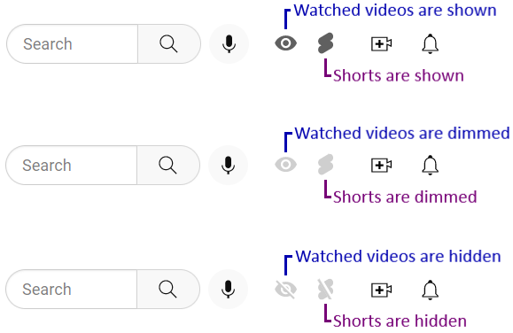

# youtube-hide-watched

A simple userscript for toggling watched videos in the YouTube subscriptions list.

The script is published on GreasyFork at: https://greasyfork.org/en/scripts/13040-youtube-hide-watched-videos

# Installation

- Install TamperMonkey or GreaseMonkey extension for your browser
- Visit https://greasyfork.org/en/scripts/13040-youtube-hide-watched-videos and hit the Install button
- Visit YouTube (or refresh the YouTube page if it's already open)

# How to Use

The script will add a little icon to the main YouTube menu:

Press this button to toggle watched videos on/off.
